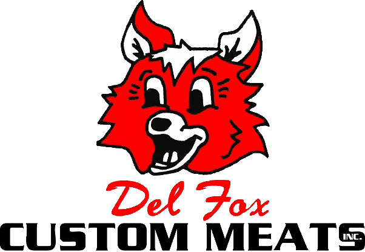
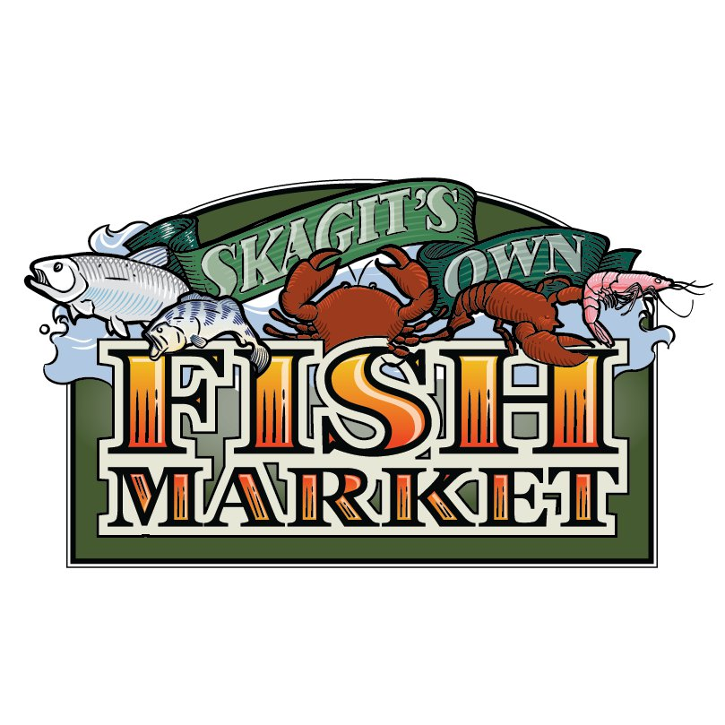
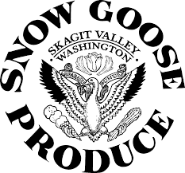
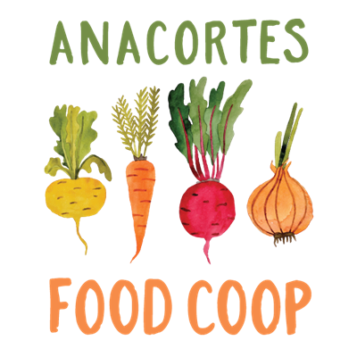

# Just Another Simulation

We are a small local business, that wanted to make a healthier teriyaki sauce, that tastes great. Our product doesn't have all the filler of most brands. No high fructose corn syrup, no xanthan gum, no starch added, and no thickeners. 

Just great flavors. Flavors that works as a marinade for chicken, beef, pork, fish, sea food, and stir fry vegetables. It's a great all around sauce, or you can just use it as a dipping sauce.

Our product have been tested by "Washington State School of food Pullman WA". It also been shelf life tested by" Exact Scientific Testing" in Ferndale Washington. It is bottled at "Wolf Packers International" in Gold bar Wa.

# Now Available At:

Del Fox Custom Meats
7229 300th St NW, Stanwood, WA 98292

Andal's Custom Meats Inc.
20235 E. Hickox RD. Mount Vernon, WA 98274

Skagit's Own Fish Market
18042 State Rte 20, Burlington, WA 98233

Snow Goose Produce
15170 Fir Island Rd, Mount Vernon, WA 98273

Anacortes Food Coop
2403 Commercial Ave. Suite B, Anacortes WA 98221

Mount Vernon Red Apple Market
820 Cleveland Ave, Mount Vernon, WA 98273